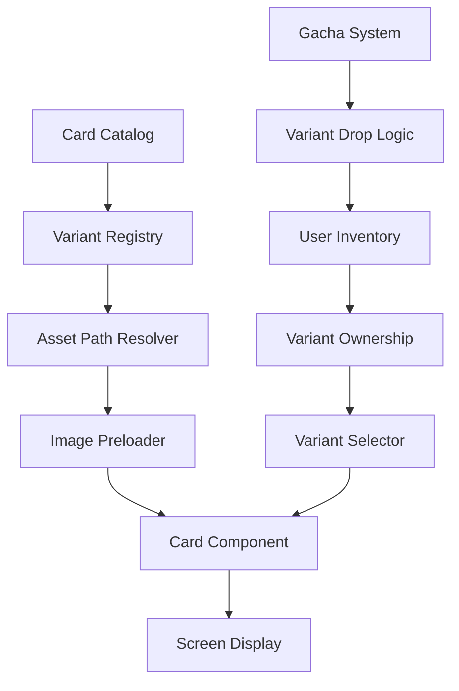

# Design Document

## Overview

This design introduces a visual overhaul of the card system, transforming cards from simple UI elements into beautifully illustrated TCG-style cards with 3:4 aspect ratio artwork. The system implements an alternate design feature that treats variants as separate collectible entities, creating engagement through rarity and collection mechanics. The design prioritizes performance through strategic image preloading and thumbnail optimization while maintaining visual quality.

### Key Design Principles

1. **Visual Excellence**: Cards should feel premium and collectible, similar to physical TCG cards
2. **Performance First**: Smooth loading and rendering across all devices, especially mobile
3. **Collectibility**: Alternate designs create meaningful collection goals and future monetization paths
4. **Flexibility**: System supports easy addition of new cards and variants
5. **Accessibility**: Text remains readable, touch targets are appropriately sized for mobile

## Architecture

### High-Level Component Structure

```
Card Visual System
├── Card Data Layer
│   ├── Base Card Definitions (existing)
│   ├── Variant Definitions (new)
│   └── Image Asset Registry (new)
├── Card Rendering Layer
│   ├── GameCard Component (redesigned)
│   ├── CardThumbnail Component (new)
│   └── Faction Theme System (new)
├── Asset Management Layer
│   ├── Image Preloader (enhanced)
│   ├── Asset Path Resolver (new)
│   └── Lazy Loading Manager (new)
└── Collection & Selection Layer
    ├── Variant Selector (new)
    ├── Collection View Toggle (new)
    └── Gacha Variant System (enhanced)
```

### Data Flow



## Components and Interfaces

### 1. Card Data Structure

#### Extended Card Type

```typescript
// Extends existing Card interface
interface CardVariant {
  id: string;                    // e.g., "general-ivanka-alt-1"
  baseCardId: number;            // Reference to base card
  variantName: string;           // e.g., "Alternate Art 1"
  variantType: 'base' | 'alternate';
  rarity: 'common' | 'rare' | 'epic' | 'legendary';  // Variant-specific rarity
  imageAssets: {
    full: string;                // Path to full-size image (3:4 ratio)
    thumbnail: string;           // Path to thumbnail image
  };
}

// Variant registry maps base card IDs to their variants
interface VariantRegistry {
  [baseCardId: number]: CardVariant[];
}
```

#### Asset Path Structure

```
src/client/public/cards/
├── full/
│   ├── base/
│   │   ├── 1.jpg              // Base card ID 1
│   │   ├── 2.jpg
│   │   └── ...
│   └── variants/
│       ├── 1-alt-1.jpg        // Card 1, alternate 1
│       ├── 1-alt-2.jpg
│       └── ...
└── thumbnails/
    ├── base/
    │   ├── 1.jpg
    │   └── ...
    └── variants/
        ├── 1-alt-1.jpg
        └── ...
```

### 2. GameCard Component (Redesigned)

The main card display component with CSS overlay design.

#### Component Structure

```typescript
interface GameCardProps {
  card: Card;                    // Base card data
  variant?: CardVariant;         // Optional variant override
  size?: 'full' | 'thumbnail';   // Display size
  interactive?: boolean;         // Enable hover/click effects
  showStats?: boolean;           // Show detailed stats
  className?: string;
}

const GameCard: React.FC<GameCardProps> = ({
  card,
  variant,
  size = 'full',
  interactive = false,
  showStats = true,
  className
}) => {
  // Component implementation
};
```

#### Visual Layout

```
┌─────────────────────┐
│  #12  ★★★  Lvl 3   │ ← Top overlay (card number, level)
│                     │
│                     │
│   [Card Image]      │ ← 3:4 aspect ratio illustration
│                     │
│                     │
│                     │
│  General Ivanka     │ ← Card name overlay
│  ─────────────────  │
│  🪖 5000 Soldiers   │ ← Bottom stats overlay
│  ⚡ First Strike    │ ← Ability
│  "Description..."   │ ← Flavor text
└─────────────────────┘
```

#### CSS Overlay Design

The card uses a layered approach:
1. **Background Layer**: Card illustration image
2. **Gradient Overlays**: Semi-transparent gradients at top/bottom for text readability
3. **Content Layer**: Text and stats positioned absolutely
4. **Border/Frame**: Faction-themed border and decorative elements

### 3. Faction Theme System

#### Theme Configuration

```typescript
interface FactionTheme {
  primary: string;        // Primary color
  secondary: string;      // Secondary color
  gradient: string;       // Gradient for overlays
  border: string;         // Border style
  glow: string;          // Glow/shadow effect
  textShadow: string;    // Text shadow for readability
}

const FACTION_THEMES: Record<Faction, FactionTheme> = {
  [Faction.White]: {
    primary: '#fbbf24',           // Amber-400
    secondary: '#f59e0b',         // Amber-500
    gradient: 'linear-gradient(to bottom, rgba(251, 191, 36, 0.9), rgba(245, 158, 11, 0.7))',
    border: '2px solid #fbbf24',
    glow: '0 0 20px rgba(251, 191, 36, 0.5)',
    textShadow: '2px 2px 4px rgba(0, 0, 0, 0.8)'
  },
  [Faction.Black]: {
    primary: '#c084fc',           // Purple-400
    secondary: '#a855f7',         // Purple-500
    gradient: 'linear-gradient(to bottom, rgba(192, 132, 252, 0.9), rgba(168, 85, 247, 0.7))',
    border: '2px solid #c084fc',
    glow: '0 0 20px rgba(192, 132, 252, 0.5)',
    textShadow: '2px 2px 4px rgba(0, 0, 0, 0.8)'
  }
};
```

#### Visual Differentiation

- **White Faction**: Warm gold/amber tones, clean lines, regal aesthetic
- **Black Faction**: Cool purple/violet tones, sharp edges, mystical aesthetic
- **Shared Elements**: Both use semi-transparent overlays to ensure text readability

### 4. Asset Management System

#### Image Preloader Enhancement

```typescript
interface PreloadConfig {
  screen: string;                // Screen identifier
  assets: {
    cards: {
      ids: number[];             // Card IDs to preload
      variants?: string[];       // Variant IDs to preload
      size: 'full' | 'thumbnail';
    };
    images: string[];            // Additional images
  };
}

// Enhanced useAssetPreloader hook
const useAssetPreloader = (config: PreloadConfig) => {
  const [loaded, setLoaded] = useState(false);
  const [progress, setProgress] = useState(0);
  const [error, setError] = useState<string | null>(null);
  
  // Preload logic with progress tracking
  // Returns: { loaded, progress, error }
};
```

#### Lazy Loading Strategy

```typescript
// For collection screen only
const useLazyCardImages = (cardIds: number[], threshold = 0.1) => {
  // Intersection Observer implementation
  // Loads images as they approach viewport
};
```

#### Asset Path Resolver

```typescript
class CardAssetResolver {
  static getImagePath(
    cardId: number,
    variant?: CardVariant,
    size: 'full' | 'thumbnail' = 'full'
  ): string {
    const sizeDir = size === 'full' ? 'full' : 'thumbnails';
    
    if (variant && variant.variantType === 'alternate') {
      return `/cards/${sizeDir}/variants/${variant.id}.jpg`;
    }
    
    return `/cards/${sizeDir}/base/${cardId}.jpg`;
  }
  
  static getFallbackPath(size: 'full' | 'thumbnail' = 'full'): string {
    return `/cards/${size}/placeholder.jpg`;
  }
}
```

### 5. Variant Selection System

#### Variant Selector Component

Used in battle creation and deck building screens.

```typescript
interface VariantSelectorProps {
  card: Card;
  ownedVariants: CardVariant[];
  selectedVariant: CardVariant;
  onSelect: (variant: CardVariant) => void;
}

const VariantSelector: React.FC<VariantSelectorProps> = ({
  card,
  ownedVariants,
  selectedVariant,
  onSelect
}) => {
  // Displays horizontal scrollable list of owned variants
  // Shows locked state for unowned variants
  // Highlights currently selected variant
};
```

#### Variant Ownership Tracking

```typescript
// Extends inventory system
interface PlayerInventoryWithVariants {
  cards: Array<{
    cardId: number;
    variantId: string;
    quantity: number;
  }>;
}

// Example:
// User owns: 2x base "General Ivanka", 1x alt-1 "General Ivanka"
// Stored as:
// [
//   { cardId: 5, variantId: "5-base", quantity: 2 },
//   { cardId: 5, variantId: "5-alt-1", quantity: 1 }
// ]
```

### 6. Collection View Toggle

#### Toggle Component

```typescript
interface CollectionViewMode {
  mode: 'base' | 'variants';
  showUnowned: boolean;
}

const CollectionViewToggle: React.FC<{
  mode: CollectionViewMode;
  onChange: (mode: CollectionViewMode) => void;
}> = ({ mode, onChange }) => {
  // Toggle between base and variant views
  // Option to show/hide unowned cards
};
```

#### Collection Display Logic

**Base View Mode:**
- Shows one entry per unique base card
- Badge indicator if alternate variants exist
- Badge shows how many variants owned vs. available

**Variants View Mode:**
- Shows all variants (base + alternates) as separate entries
- Locked/unlocked state clearly indicated
- Rarity indicators for alternate variants

### 7. Gacha Integration

#### Variant Drop System

```typescript
interface GachaPool {
  baseCards: Array<{
    card: Card;
    weight: number;
  }>;
  variants: Array<{
    variant: CardVariant;
    weight: number;        // Lower weight = rarer
  }>;
}

// Drop rate example:
// Level 1 base card: weight 50
// Level 1 alternate: weight 5 (10x rarer)
// Level 5 base card: weight 10
// Level 5 alternate: weight 1 (10x rarer)
```

#### Variant Reveal Animation

Enhanced gacha reveal to highlight alternate variants:
- Special particle effects for alternate pulls
- Rarity-based color schemes
- "NEW VARIANT!" badge for first-time pulls

## Data Models

### Variant Registry Data

```json
{
  "variants": [
    {
      "id": "1-base",
      "baseCardId": 1,
      "variantName": "Standard",
      "variantType": "base",
      "rarity": "common",
      "imageAssets": {
        "full": "/cards/full/base/1.jpg",
        "thumbnail": "/cards/thumbnails/base/1.jpg"
      }
    },
    {
      "id": "1-alt-1",
      "baseCardId": 1,
      "variantName": "Golden Edition",
      "variantType": "alternate",
      "rarity": "epic",
      "imageAssets": {
        "full": "/cards/full/variants/1-alt-1.jpg",
        "thumbnail": "/cards/thumbnails/variants/1-alt-1.jpg"
      }
    }
  ]
}
```

### Redis Data Structure

```typescript
// Inventory with variants
// Key: inventory:{username}
// Type: Sorted Set
// Members: "{cardId}:{variantId}" (e.g., "5:5-alt-1")
// Scores: Timestamp of acquisition

// Variant preferences (for battle display)
// Key: variant-prefs:{username}
// Type: Hash
// Fields: cardId -> variantId
// Example: { "5": "5-alt-1", "12": "12-base" }
```

## Error Handling

### Image Loading Failures

1. **Fallback Images**: Display placeholder if image fails to load
2. **Retry Logic**: Attempt reload on network errors
3. **Error Logging**: Track failed loads for debugging
4. **User Feedback**: Show "Image unavailable" message

### Variant Data Inconsistencies

1. **Validation**: Verify variant references valid base cards
2. **Graceful Degradation**: Fall back to base variant if alternate missing
3. **Sync Checks**: Ensure inventory variants exist in registry

### Performance Issues

1. **Loading Timeouts**: Set maximum wait time for preloading
2. **Progressive Enhancement**: Show UI with placeholders if preload slow
3. **Memory Management**: Unload images when navigating away from screens

## Testing Strategy

### Visual Testing

1. **Card Rendering**: Verify all cards render correctly with images
2. **Faction Themes**: Confirm white/black styling applies properly
3. **Responsive Design**: Test on various screen sizes (mobile, tablet, desktop)
4. **Text Readability**: Ensure overlays provide sufficient contrast

### Functional Testing

1. **Variant Selection**: Test selecting different variants in battle creation
2. **Collection Toggle**: Verify base/variant view switching works
3. **Gacha Pulls**: Confirm variants drop at correct rates
4. **Inventory Tracking**: Verify separate tracking of base and alternate cards

### Performance Testing

1. **Preload Times**: Measure image loading times on various connections
2. **Memory Usage**: Monitor memory consumption with many cards loaded
3. **Lazy Loading**: Verify collection screen loads efficiently
4. **Animation Performance**: Ensure smooth 60fps animations

### Integration Testing

1. **Battle Flow**: Test full flow from variant selection to battle display
2. **Gacha to Collection**: Verify pulled variants appear in collection
3. **Cross-Screen Consistency**: Ensure variant preferences persist across screens

## Implementation Phases

### Phase 1: Foundation (Core Infrastructure)
- Create variant data structure and registry
- Implement asset path resolver
- Set up image asset directories
- Create placeholder images for testing

### Phase 2: Card Component Redesign
- Redesign GameCard component with image background
- Implement CSS overlay system
- Create faction theme system
- Build CardThumbnail component

### Phase 3: Asset Management
- Enhance image preloader for cards
- Implement lazy loading for collection
- Add error handling and fallbacks
- Create loading states and placeholders

### Phase 4: Variant System
- Extend inventory to track variants
- Build variant selector component
- Implement variant preference storage
- Update gacha system for variant drops

### Phase 5: UI Integration
- Add collection view toggle
- Update battle creation with variant selection
- Enhance gacha reveal for variants
- Update all screens to use new card components

### Phase 6: Polish and Optimization
- Performance optimization
- Visual polish and animations
- Comprehensive testing
- Documentation

## Technical Considerations

### Mobile Optimization

- **Touch Targets**: Minimum 44x44px for interactive elements
- **Image Sizes**: Optimize for mobile bandwidth (WebP format, compression)
- **Responsive Text**: Scale text appropriately for small screens
- **Gesture Support**: Swipe for variant selection on mobile

### Browser Compatibility

- **Image Formats**: Provide fallbacks for WebP (PNG/JPG)
- **CSS Features**: Use autoprefixer for vendor prefixes
- **Intersection Observer**: Polyfill for older browsers

### Accessibility

- **Alt Text**: Descriptive alt text for all card images
- **Keyboard Navigation**: Full keyboard support for variant selection
- **Screen Readers**: ARIA labels for card information
- **Color Contrast**: Ensure WCAG AA compliance for text overlays

### Future Extensibility

- **Animation System**: Framework for card animations (flip, shine, etc.)
- **Special Effects**: Support for animated/holographic variants
- **Customization**: Player-created card backs or frames
- **Trading System**: Infrastructure for variant trading between players
